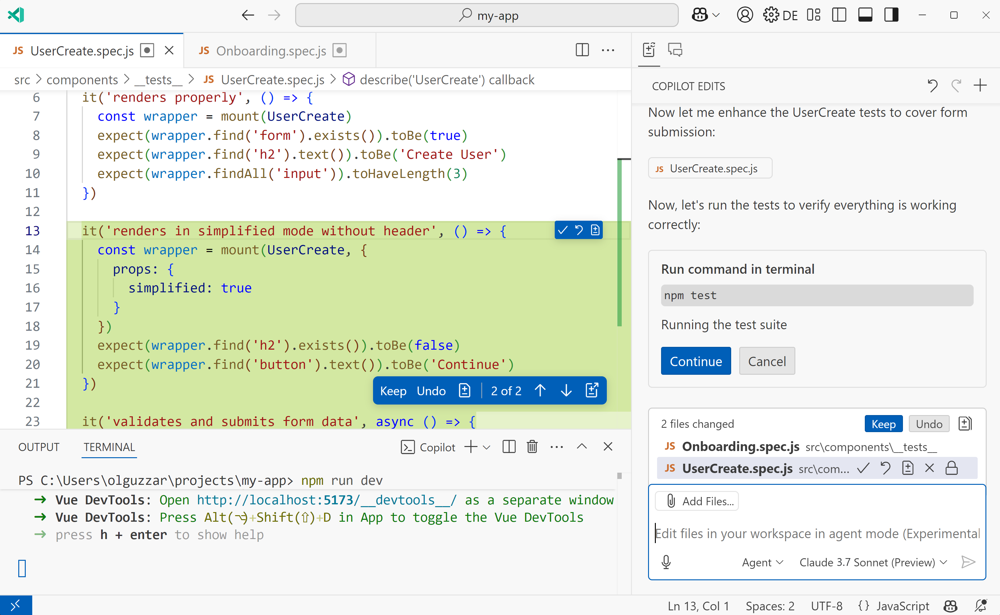

# Copilot Agent Mode

	
	<ul style="font-size: clamp(1rem, 2.5vw, 1.4rem); line-height: 1.6;">
		<li>analyzing your codebase</li>
		<li>reading relevant files</li>
		<li>proposing file edits</li>
		<li>running terminal commands and tests</li>
	</ul>

