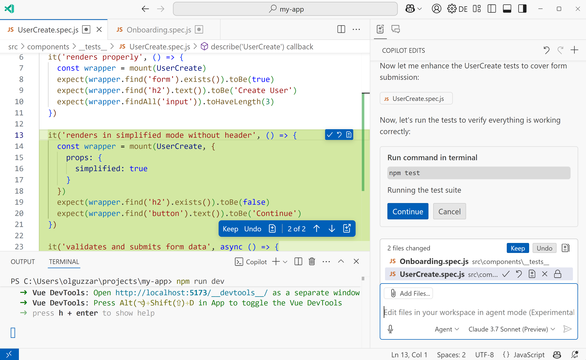

# Copilot Agent Mode

|                                                       |                                                                                                                                                   |
| ----------------------------------------------------: | :------------------------------------------------------------------------------------------------------------------------------------------------ |
| { width=50%  } | <ul><li>analyzing your codebase</li><li>reading relevant files</li><li>proposing file edits</li><li>running terminal commands and tests</li></ul> |

